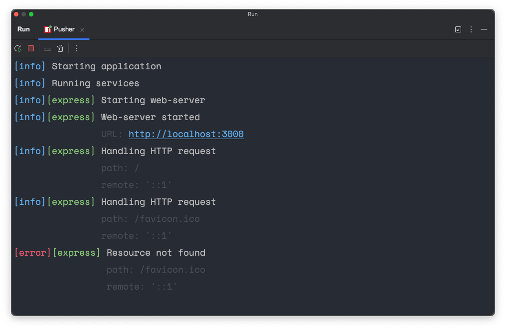

# @relab/node-logger

Winston-based logger configuration with Telegram integration.



## Usage

1. `npm install --save @relab/node-logger`
2. Configure layout, verbosity level and Telegram (if necessary)
3. Patch `console` object:
```typescript
import { patchCommonLogger } from '@relab/node-logger'
patchCommonLogger()
```
4. Import `logger` to write logs into default area
5. Import `scoped` to create log area

## Configuration

### Layout
```typescript
import { configureLogger } from '@relab/node-logger'
configureLogger({ kind: 'layout', layout: ['timestamp', 'level', 'area', 'message', 'details', 'error'] })
```

### Verbosity level
```typescript
import { configureLogger } from '@relab/node-logger'
configureLogger({ kind: 'verbosity', verbosity: { area: '*', level: 'error' } })
configureLogger({ kind: 'verbosity', verbosity: { area: 'express', level: 'debug' } })
```

### Telegram
```typescript
import { configureLogger } from '@relab/node-logger'
configureLogger({
    kind: 'telegram',
    telegram: {
        enabled: true,
        token: process.env.LOGGER_TELEGRAM_TOKEN ?? '',
        chatId: Number(process.env.LOGGER_TELEGRAM_CHAT_ID),
    }
})
```

## Example of usage
```typescript
import { patchCommonLogger, logger, scoped, configureLogger } from '@relab/node-logger'

// Configure and patch logger
configureLogger({ kind: 'layout', layout: ['timestamp', 'level', 'area', 'message', 'details', 'error'] })
configureLogger({ kind: 'verbosity', verbosity: { area: '*', level: 'error' } })
configureLogger({ kind: 'verbosity', verbosity: { area: 'express', level: 'debug' } })
configureLogger({
    kind: 'telegram',
    telegram: {
        enabled: true,
        token: process.env.LOGGER_TELEGRAM_TOKEN ?? '',
        chatId: Number(process.env.LOGGER_TELEGRAM_CHAT_ID),
    }
})
patchCommonLogger()

// Create scoped logger
const expressLogger = scoped('express')

// Use logger
logger.info('Starting application')
expressLogger.info('Starting web-server')
expressLogger.error('Unable to start web-server')
console.log('Default message') // also works
```

## License

Released under [MIT](/LICENSE) by [Sergey Zwezdin](https://github.com/sergeyzwezdin).
